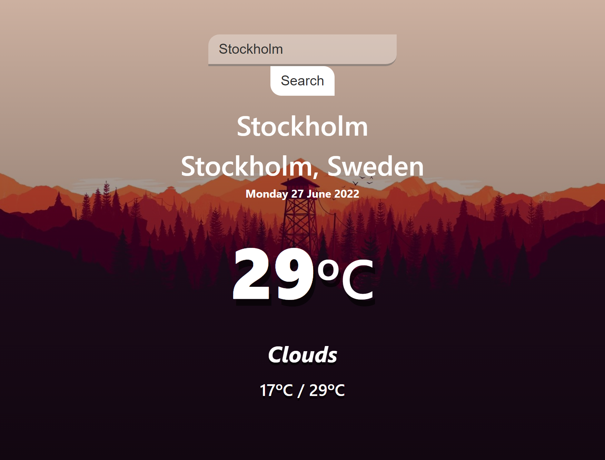

<div align="center">

# Weather App

A Weather App made with React :cloud:



</div>

# Description

This project was made using [`React`](https://github.com/facebook/react) and [`styled-components`](https://github.com/styled-components/styled-components).

The forecasting is made using 2 different APIs:

- [`Mapbox`](https://docs.mapbox.com/api/overview/) - To obtain city's coordinates.

- [`OpenWeatherMap`](https://openweathermap.org/api) - To get forecasting based on coordinates.


# Setup

You need to setup `.env` file with the APIs keys as `Environment Variables` to make this project work.

Environment Variables are a little different to config when working with [`React`](https://github.com/facebook/react).

Reading the `Create React App` docs section about [Adding Custom Environment Variables](https://create-react-app.dev/docs/adding-custom-environment-variables/), you find this:
```
You must create custom environment variables beginning with REACT_APP_. Changing any environment variables will require you to restart the development server if it is running.
```

example:
```
REACT_APP_MAP_TOKEN=YOUR_TOKEN_HERE
```

Then, you can access this variable with `process.env` object:

```javascript
process.env.REACT_APP_MAP_TOKEN

## Disclaimer

`WARNING`: Do not store any secrets (such as private API keys) in your React app!

Environment variables are embedded into the build, meaning anyone can view them by inspecting your app's files.

# Features

- Get Weather Forecast from any city;
- The Background Image changes by current user dateTime;

<div align="center">


 


</div>
